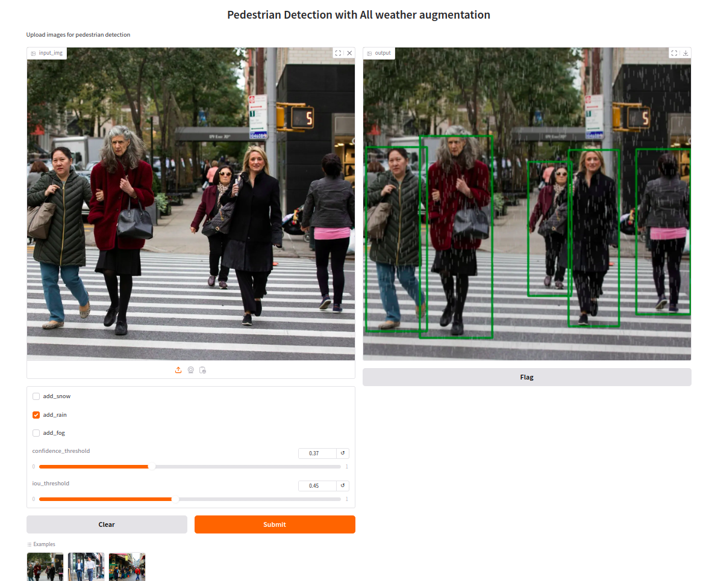

### YOLOX PEDESTRIAN DETECTION WITH ALL WEATHER AUGMENTATION ###



#### Spaces [demo link](https://huggingface.co/spaces/vk888/yolox-pedestrian-detection-all-weather-augmentation) ####

##### YOLOX Nano model is trained with Roboflow pedestrian dataset and augmentations simulating Snow,Rain,Fog & Sunflare conditions along with YOLOX mixup aug #####

### Inference ###

#### C++ ONNX ####

```commandline
$cd cpp
#download OpenCV & Onnx libs and update path in CMakeLists
$cmake .
$make 
$./yolox_onnx ../models/pedestrian-detection-best95.onnx ../test-images/test1.jpg
```

#### Python ONNX / TensorRT ####

```commandline
$pip install -r inference_requirements.txt
#onnx
$python yolox_onnx.py
#TensorRT
$python yolox_trt.py
```


### Training , Evaluation & Export to ONNX ###

```commandline
$pip install -r requirements.txt
$python train.py -f exps/default/yolox_nano.py -d 1 -b 8 --fp16 -o --resume -c 'yolox-pedestrian-detection-all-weather-aug/YOLOX_outputs/yolox_nano/your-pth'
$python eval.py -f exps/default/yolox_nano.py -c 'yolox-pedestrian-detection-all-weather-aug/YOLOX_outputs/yolox_nano/your-pth'
$python export_onnx.py -f exps/default/yolox_nano.py -c yolox-pedestrian-detection-all-weather-aug/YOLOX_outputs/yolox_nano/your-pth  --output-name yolox-pedestrian-detection-all-weather-aug/YOLOX_outputs/yolox_nano/pedestrian-detection.onnx
```